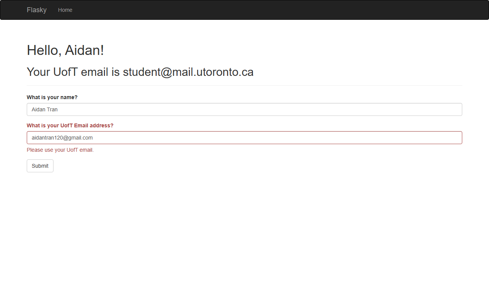

# ECE444 PRA3: Flask and Docker

Aidan Tran

This repo is a clone of https://github.com/miguelgrinberg/flasky.
The textbook examples use the author's [first-edition code](https://github.com/miguelgrinberg/flasky-first-edition).

## Run locally

Use Python 3.13. From this folder in Windows Command Prompt:

```bat
python -m venv .venv
.venv\Scripts\activate
python -m pip install -r requirements.txt
python -m flask --app hello run
```

Open http://localhost:5000. For PowerShell, activate with
`.\.venv\Scripts\Activate.ps1` instead.

The Home form stores the submitted name in the session.
Changing the name shows a flashed message.
The email field accepts a valid address containing `utoronto` and displays
an error for other addresses.

The Docker activities use the `PRA3_2` branch.

Start Docker Desktop with Linux containers enabled. Check it with `docker version`.

The greeting includes "Welcome to PRA3 Docker!".

## Run with Docker

Start Docker Desktop with Linux containers enabled, then run:

```bat
docker build -t e444-pra3 .
docker run -d --name e444-pra3 -p 127.0.0.1:5000:5000 e444-pra3
docker ps -a
docker logs e444-pra3
```

Open http://localhost:5000. Stop the container with `docker stop e444-pra3`.
To run it again, use `docker start e444-pra3`.


## Chatbot

Submit your name and a valid email containing `utoronto` to enter the chat.
Send `My name is Alice.` followed by `What is my name?` to see the bot remember
the name. Log out, enter through the form again, and ask the same question.
The bot should no longer remember Alice.

The bot stores the name in Flask's `session`. Flask keeps this data in a signed
browser cookie that the browser sends with each request. Logout calls
`session.clear()`, so it clears the memory without restarting the app.
Set the `SECRET_KEY` environment variable to keep the same signing key across
restarts; otherwise the app generates one at startup.

## Required screenshots

Activity 1.3: navigation bar, greeting, and local timestamp in `LLLL` format.


Activity 1.4: first and last name with a non-UofT email.


