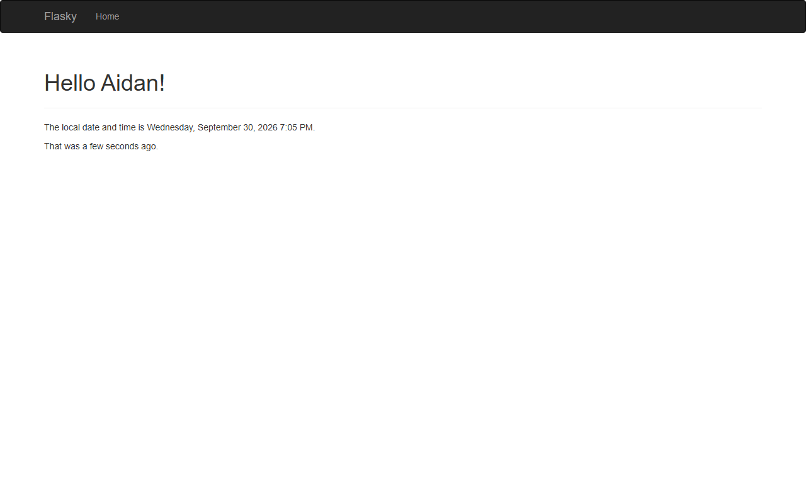

# ECE444 PRA3: Flask and Docker

Aidan Tran

This repo is a clone of https://github.com/miguelgrinberg/flasky.
The textbook examples use the author's [first-edition code](https://github.com/miguelgrinberg/flasky-first-edition).

## Run locally

Use Python 3.13. From this folder in Windows Command Prompt:

```bat
python -m venv .venv
.venv\Scripts\activate
python -m pip install -r requirements.txt
python -m flask --app hello run
```

Open http://localhost:5000. For PowerShell, activate with
`.\.venv\Scripts\Activate.ps1` instead.

The Home form stores the submitted name in the session.
Changing the name shows a flashed message.

## Required screenshots

Activity 1.3: navigation bar, greeting, and local timestamp in `LLLL` format.


